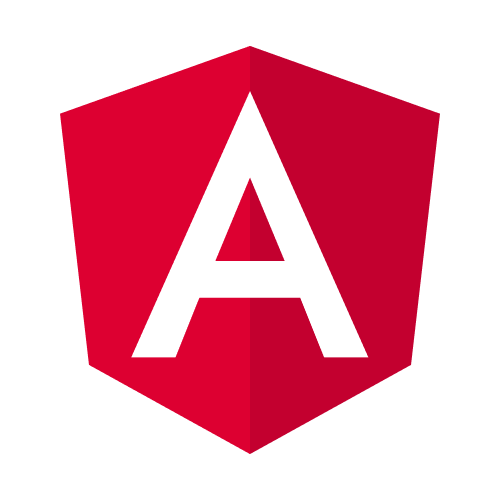
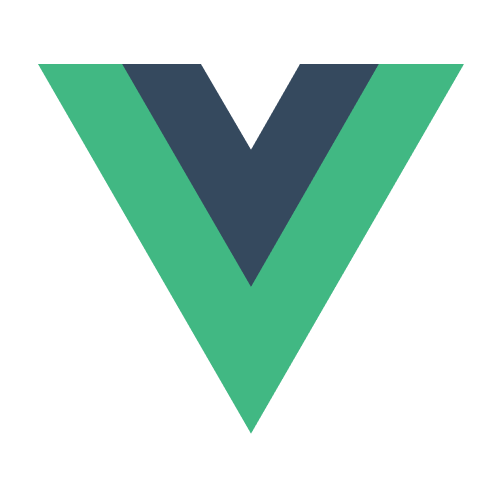

---

Start your GoodData.UI journey with hands-on experience:
















## Supported Frameworks and APIs

As a developer, make use of our development kits and API:




Embed GoodData visualizations and dashboards into a web application in a framework agnostic way.



Embed GoodData analytics into a React web application and customize how they are displayed.



Load raw analytical data into your browser or NodeJS application using Custom Executions.




## Other Integrations

The following frameworks are not natively supported, but you can still use them work with GoodData.UI to embed GoodData content into your web applications:

    
    <a href="https://www.gooddata.com/blog/frontend-integration-series-angular/" target="_blank">Angular</a>

    
    <a href="https://www.gooddata.com/blog/frontend-integration-series-nextjs/" target="_blank">Next.js</a>

    
    <a href="https://www.gooddata.com/blog/frontend-integration-series-vue-js/" target="_blank">Vue.js</a>

    
    <a href="https://www.gooddata.com/blog/frontend-integration-series-sveltekit/" target="_blank">SvelteKit</a>

## Join & Learn

Meet other GoodData developers, talk with us and learn:



Meet other GoodData developers. Search our knowledge base.

[Join us on Slack](https://join.slack.com/t/gooddataconnect/shared_invite/zt-mkqhg6bm-omgjndejTlTyB3wgaVkkGQ)



Find answers, share ideas, be inspired and inspire others!

[Check community](https://community.gooddata.com/)



Learn how to use GoodData with our hands-on tutorials.

[Do our courses](https://university.gooddata.com/)



