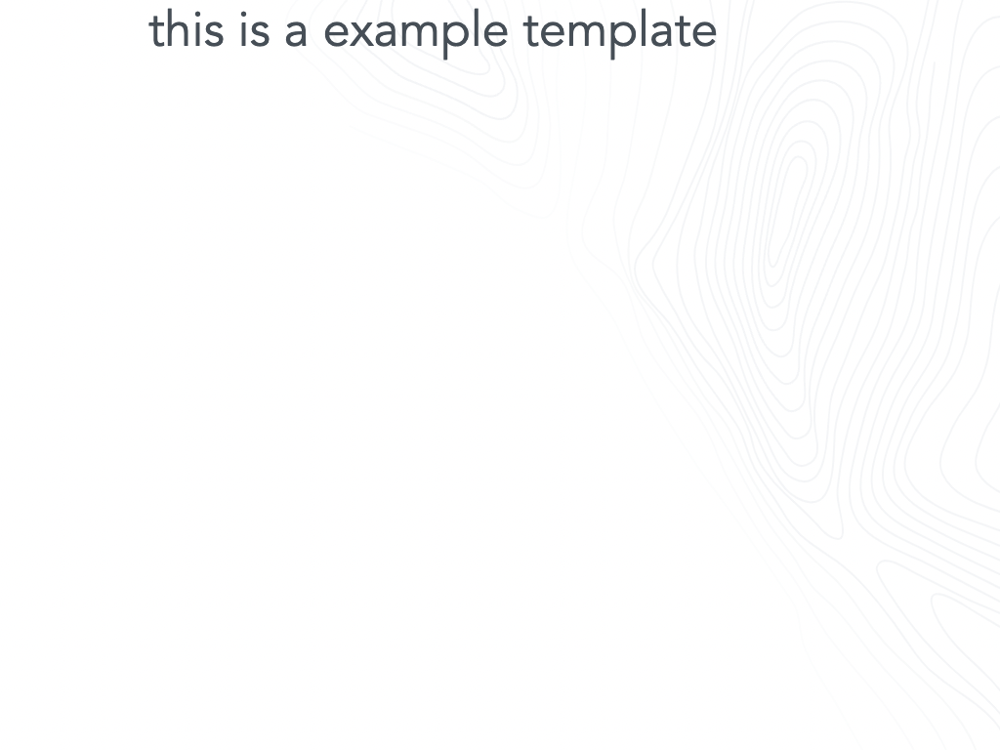

# GoodData.UI SDK - Interactive Examples - {EXAMPLE-TITLE}

{EXAMPLE-DESCRIPTION}

You can run this example in [CodeSandbox]({CODESANDBOX-PATH}). Navigate [up](../../) for more information.

## Run example locally

### In sdk-ui-sdk

If you cloned whole sdk-ui-sdk repository

1. `rush install`
2. `rush build`
3. navigate to example directory
4. `npm run start`

### Just example directory

Do not use this if you cloned whole mono repo it will break rush workspaces

1. navigate to example directory
2. `npm run update-version`
3. `npm install`
4. `npm start`

## License

(C) 2017-2021 GoodData Corporation

This repository is under the GoodData commercial license available in the [LICENSE](LICENSE) file because it contains a commercial package, HighCharts.
