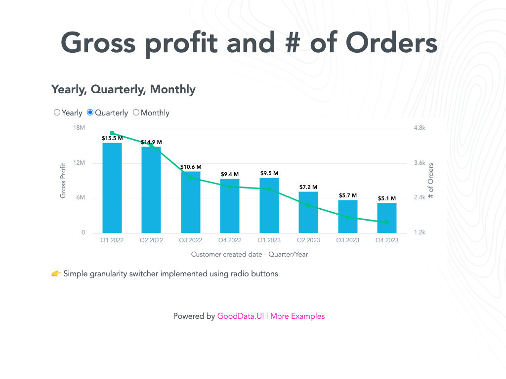

# GoodData.UI SDK - Interactive Examples - Granularity

This example exmplains DateFilter granularity

You can run this example in [CodeSandbox](https://codesandbox.io/p/sandbox/github/gooddata/gooddata-ui-sdk/tree/master/examples/sdk-interactive-examples/examples/example-granularity?file=/src/example/Example.tsx). Navigate [up](../../) for more information.

## Run example locally

### In sdk-ui-sdk

If you cloned whole sdk-ui-sdk repository

1. `rush install`
2. `rush build`
3. navigate to example directory
4. `npm run start`

### Just example directory

Do not use this if you cloned whole mono repo it will break rush workspaces

1. navigate to example directory
2. `npm run update-version`
3. `npm install`
4. `npm start`

## License

(C) 2017-2021 GoodData Corporation

This repository is under the GoodData commercial license available in the [LICENSE](LICENSE) file because it contains a commercial package, HighCharts.
